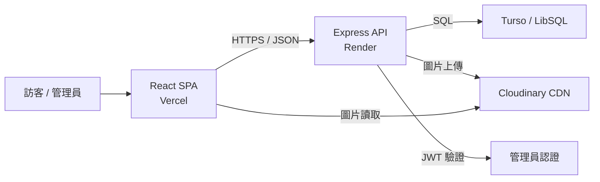

<div align="center">
  

# NSYSU Investment & Trading Research Club

### 國立中山大學投資研習社官方網站

整合社團介紹、課程規劃、活動紀錄、成果發表與學習資源的內容平台。

[Instagram](https://www.instagram.com/nsysu_itrc/) · [中山大學課程資訊](https://gam.nsysu.edu.tw/p/404-1349-312656.php?Lang=zh-tw)
</div>

## 關於官網

NSYSU ITRC 官網是中山投研對外的數位入口。網站集中呈現社團理念、課程與講師資訊、歷屆成果、活動紀錄、成員心得與投資學習資源，讓學生、校友、講師與合作夥伴能快速了解社團。

本專案不只是靜態官網，也包含完整的內容管理後台。管理員可直接更新頁面、社員、活動、成果與資源，並透過版本快照降低內容誤刪或誤改的風險。

## 網站內容

| 區塊 | 內容 |
| --- | --- |
| 首頁 | 社團定位、課程介紹、課程資訊、指導教授與幹部團隊 |
| 成果發表 | 按學期與類別展示競賽、研究與專案成果 |
| 活動規劃 | 展示當學期課程、主題、講師與時程 |
| 活動紀錄 | 整理歷屆活動說明、圖片、影片與延伸資料 |
| 參與心得 | 收錄社員的學習經驗與參與回饋 |
| 學習資源 | 彙整線上工具、研究資料與實體書籍 |
| 站內搜尋 | 跨頁面搜尋內容、活動、成果、心得與成員 |

## 系統架構



### 前端

- React 18 與 React Router 建立 Single Page Application。
- Vite 提供本機開發、API proxy 與 production build。
- Axios 統一處理 API base URL，並在已登入狀態自動帶入 JWT。
- Framer Motion 處理頁面與互動動畫。
- Vercel rewrite 讓前端 routes 在重新整理時仍回到 `index.html`。

### 後端

- Express 提供 REST API，依內容類型分成獨立 route modules。
- LibSQL client 連接 Turso；未設定雲端連線時，可在本機使用 SQLite。
- bcrypt 儲存密碼 hash，JWT 負責管理員 session。
- Multer 使用 memory storage 接收圖片，再直接傳送至 Cloudinary，不依賴應用伺服器的暫存磁碟。
- 寫入內容前會自動產生快照；後台也可手動備份與還原。

### 資料流

1. 訪客進入 React 前端，各頁面並行向 API 讀取所需內容。
2. Express 從 Turso / SQLite 取得結構化資料並回傳 JSON。
3. 管理員登入後，前端在受保護請求的 `Authorization` header 附上 JWT。
4. 新增、更新或刪除內容時，後端先觸發自動快照，再執行資料寫入。
5. 圖片上傳由 API 驗證檔案類型與大小，儲存至 Cloudinary 後只將 CDN URL 寫入資料庫。

## 技術組合

| 層級 | 技術 |
| --- | --- |
| UI | React 18、React Router、Framer Motion |
| Build | Vite |
| HTTP client | Axios |
| API | Node.js、Express |
| Authentication | JWT、bcryptjs |
| Database | Turso、LibSQL、SQLite fallback |
| Media | Multer、Cloudinary |
| Hosting | Vercel、Render |

## API 概覽

API 預設以 `/api` 為 prefix。內容的讀取端點供前台使用；寫入、圖片上傳與快照管理需要管理員 JWT。

| Route | 用途 |
| --- | --- |
| `/api/sections` | 首頁區塊內容 |
| `/api/achievements` | 成果發表 |
| `/api/members` | 社團成員 |
| `/api/activities` | 活動規劃與活動紀錄 |
| `/api/experiences` | 參與心得 |
| `/api/resources` | 線上與實體學習資源 |
| `/api/search` | 跨模組全文關鍵字搜尋 |
| `/api/auth` | 管理員登入 |
| `/api/snapshots` | 內容快照、備份與還原 |
| `/api/upload` | Cloudinary 單張與批次圖片上傳 |
| `/api/health` | 服務健康檢查 |

## 專案結構

```text
ITRC/
├── client/
│   ├── public/images/       # 靜態圖片
│   ├── src/components/      # 共用 UI 元件
│   ├── src/context/         # 認證狀態
│   ├── src/pages/           # 公開頁面與管理後台
│   ├── src/api.js           # Axios client
│   ├── vercel.json         # SPA rewrite
│   └── vite.config.js       # Vite 與本機 API proxy
├── server/
│   ├── middleware/auth.js  # JWT middleware
│   ├── routes/             # REST API modules
│   ├── db.js               # Schema 與 LibSQL client
│   ├── seed.js             # 初始資料
│   └── index.js            # Express entry point
├── render.yaml               # Render Blueprint
└── README.md
```

## 本機開發

### 需求

- Node.js 18+
- npm
- 選用：Turso 資料庫與 Cloudinary 帳號

### 1. 設定環境變數

在專案根目錄建立 `.env`：

```dotenv
# 未設定 Turso 時，後端使用本機 SQLite
TURSO_DATABASE_URL=
TURSO_AUTH_TOKEN=

# 生產環境必填
JWT_SECRET=

# 啟用圖片上傳時必填
CLOUDINARY_CLOUD_NAME=
CLOUDINARY_API_KEY=
CLOUDINARY_API_SECRET=
```

### 2. 啟動 API

```bash
cd server
npm install
node seed.js   # 僅在需要初始資料時執行
npm start
```

API 預設啟動於 `http://localhost:3001`。

### 3. 啟動前端

```bash
cd client
npm install
npm run dev
```

前端預設啟動於 `http://localhost:5173`，Vite 會將 `/api` 與 `/uploads` 代理到本機 API。

## 建置與部署

### Frontend / Vercel

```bash
cd client
npm ci
npm run build
```

- Root Directory：`client`
- Build Command：`npm run build`
- Output Directory：`dist`
- Environment Variable：`VITE_API_URL=https://<api-domain>/api`

### Backend / Render

`render.yaml` 已定義 Node web service，以 `server` 為 root directory，並在啟動前執行資料初始化。Render 端需設定 Turso、JWT 與 Cloudinary 相關環境變數。

## 安全與維運

- `.env`、token、API key 與管理員憑證不得提交至 Git。
- Production 必須設定獨立且高強度的 `JWT_SECRET`。
- 管理員密碼以 bcrypt hash 儲存，登入 token 有效期為 24 小時。
- 圖片限制為 image MIME type，單檔上限 10 MB，批次上傳上限 20 檔。
- 自動快照設有 2 分鐘 cooldown，最多保留 50 份內容版本。
- 若任何憑證曾出現在 Git 歷史，應視為已曝露並立即更換。

## 聯絡與合作

- Instagram：[@nsysu_itrc](https://www.instagram.com/nsysu_itrc/)
- 學校：國立中山大學

歡迎對投資研究、金融教育、產學合作或活動交流有興趣的夥伴與中山投研聯繫。
